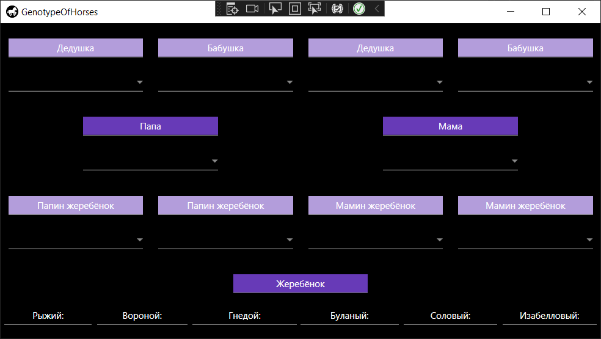
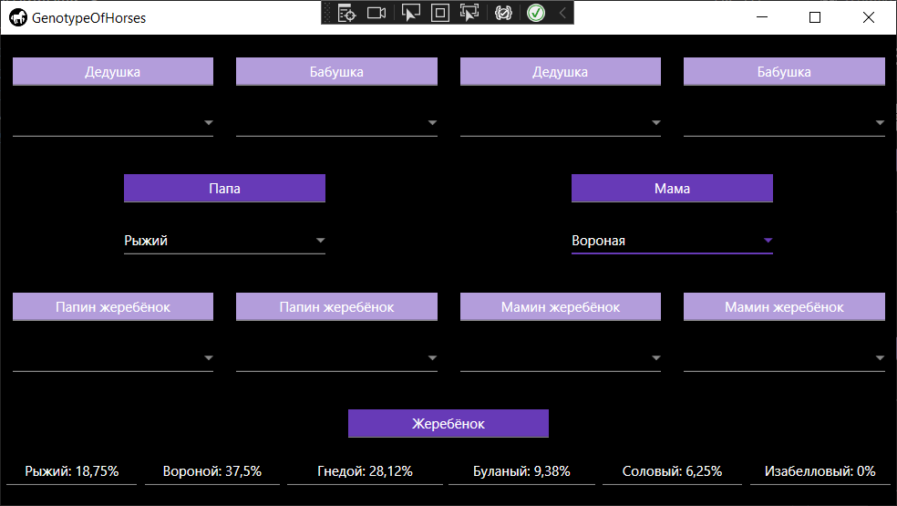
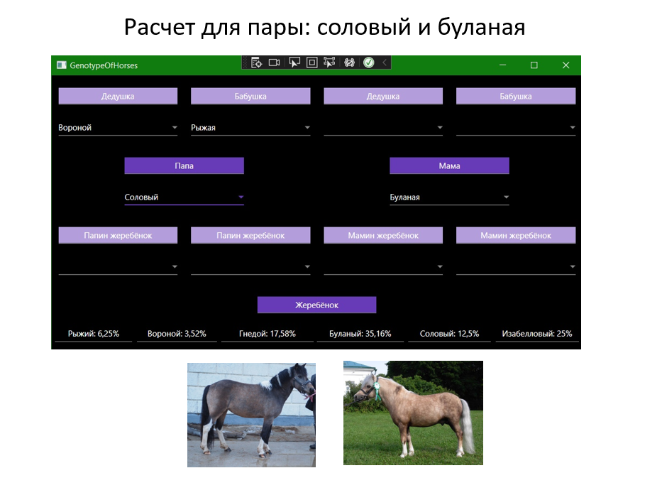

# Genetic-calculator-for-predicting-the-colts-suit

This project allows you to calculate the probability of the colt's suits based on the suits of his parents and known grandparents.

You can learn more about the project from the presentation that was presented at the XXII All-Russian Conference of Students "Steps into Science".

